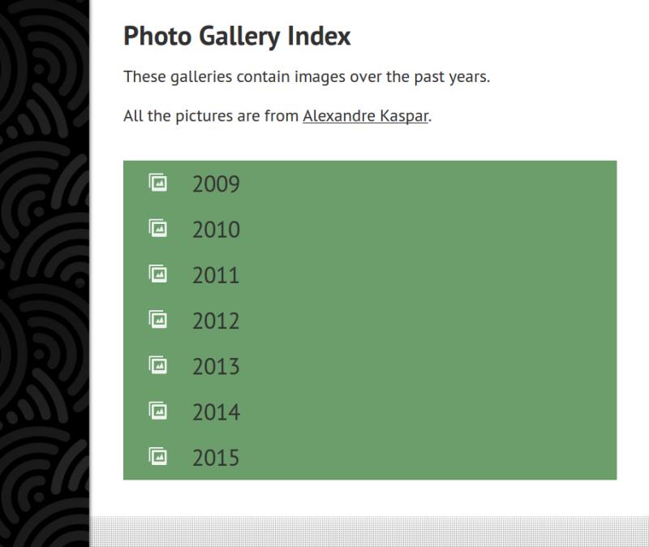

# wxy-index-theme
Theme for wxy to show galleries as a file index

## Dependencies
Included:

* [Zigfy](https://github.com/xionluhnis/zigfy) for the gallery system and image preloader.

Recommended:

* [wxy-media-index](https://github.com/xionluhnis/wxy-media-index) as media index plugin for wxy
* [wxy-thumbnails](https://github.com/xionluhnis/wxy-thumbnails) as thumbnail generator
* [wxy-empty-directory](https://github.com/xionluhnis/wxy-empty-directory) to avoid the use of `404.md` when browsing directories

## License
MIT
